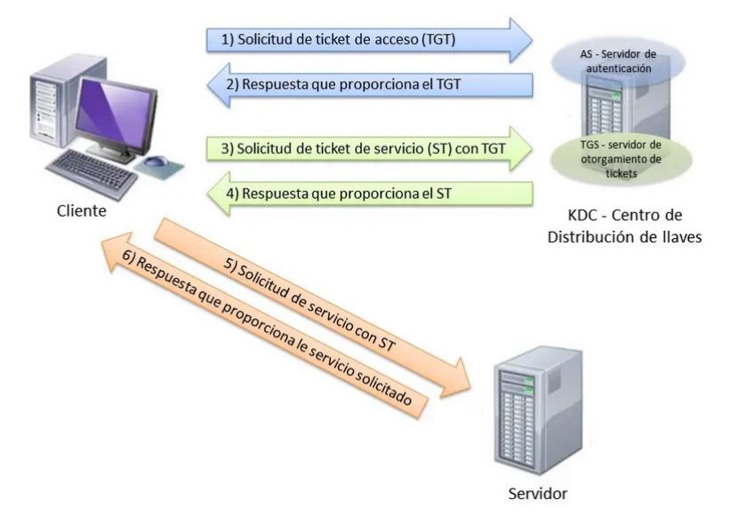
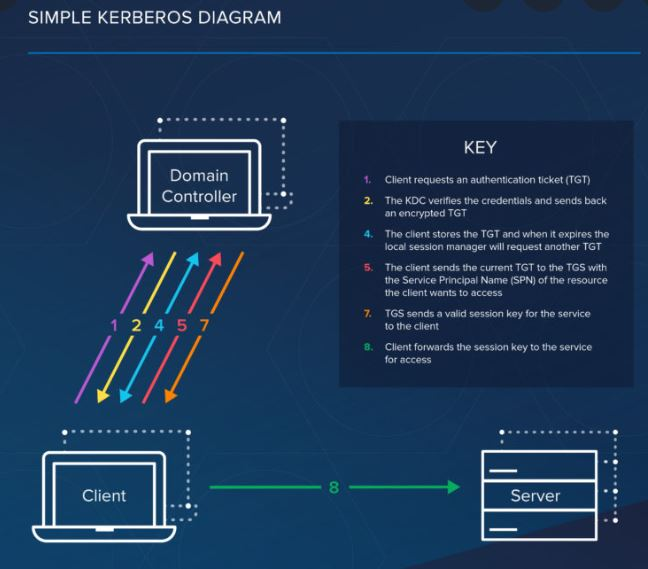

## Centro de distribución de claves

Un centro de distribución de claves (KDC) en criptografía es un sistema responsable de proporcionar claves a los usuarios en una red que comparte datos confidenciales o privados. 

Cada vez que se establece una conexión entre dos computadoras en una red, ambas solicitan al KDC que genere una contraseña única que los usuarios finales del sistema puedan usar para la verificación.

## Kerberos

Al igual que la mítica guardia, el protocolo Kerberos tiene tres cabezas: 
- Un cliente 
- Un servidor 
- Un tercero de confianza para mediar entre ellos. 

El intermediario de confianza de este protocolo es el Centro de distribución de claves (KDC).

Compuesto por dos partes lógicas separadas:
- Servidor de autenticación (AS o Authentication Server)
- Servidor emisor de tiquets (TGS o Ticket Granting Server).

Kerberos mantiene una base de datos de claves secretas y cada entidad bien sean clientes o servidores solo disponen de su clave secreta (conocida únicamente por él y Kerberos). La privacidad de esta clave es lo que hace que pueda probarse la identidad de cada uno. y para una comunicación entre dos entidades, Kerberos genera una clave de sesión, la cual pueden usar para asegurar sus comunicaciones.

Video: https://www.youtube.com/watch?v=5N242XcKAsM